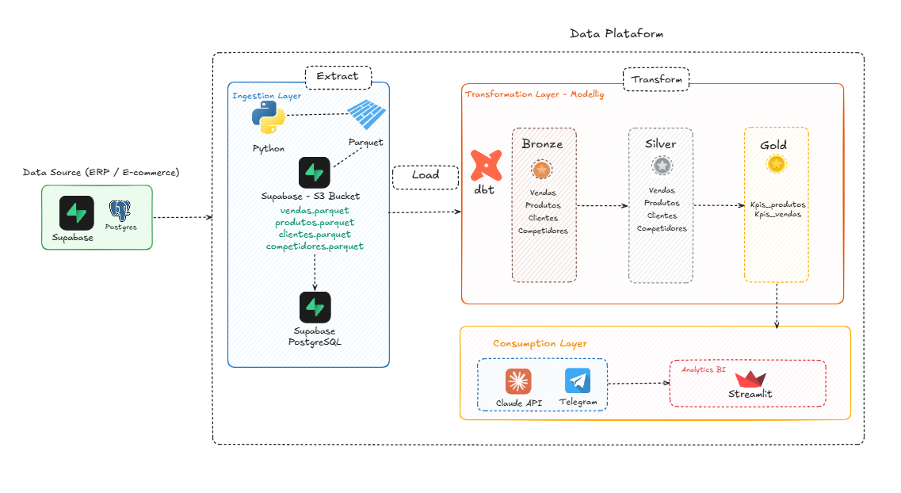
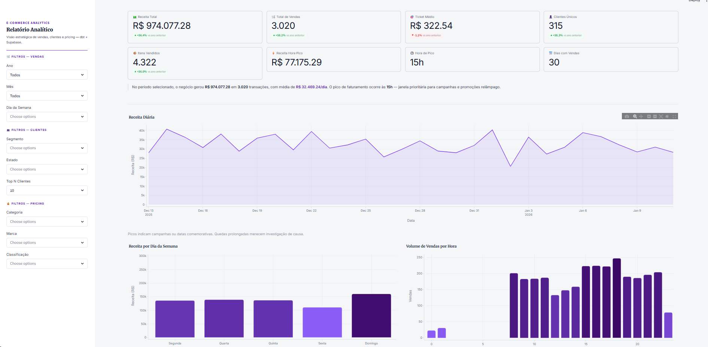
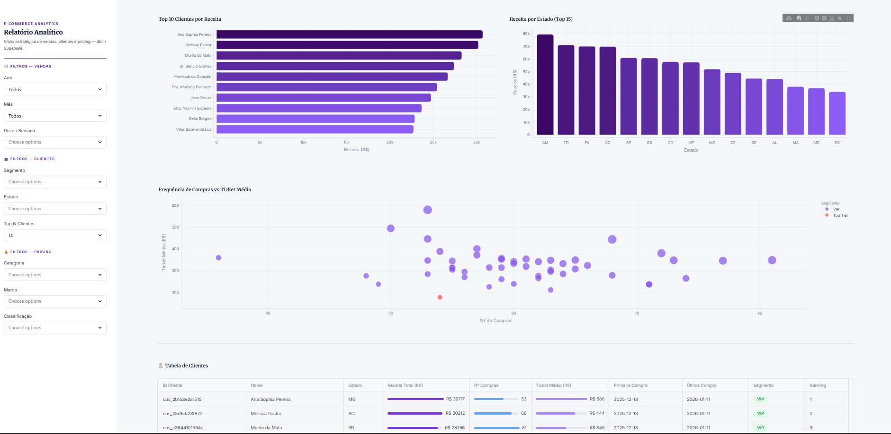

# Projeto de Engenharia de Dados: dbt + Supabase + Claude Agent IA + Telegram

Plataforma de inteligência comercial para e-commerce, construída com **dbt Core** + **Supabase (PostgreSQL)**, seguindo a arquitetura **Medalhão (Bronze → Silver → Gold)**. Inclui um dashboard analítico (Streamlit) e um agente de IA via Telegram (Claude + Anthropic SDK).



---

## Stack

| Tecnologia | Uso |
|---|---|
| **Supabase (PostgreSQL)** | Banco de dados cloud |
| **dbt Core** | Transformação e modelagem (Medalhão) |
| **Streamlit + Plotly** | Dashboard analítico interativo |
| **SQLAlchemy + psycopg2** | Conexão Python → PostgreSQL |
| **PyYAML** | Leitura de credenciais do `profiles.yml` |
| **Anthropic SDK (`claude-sonnet-4-6`)** | Agente de IA para análise e relatórios |
| **python-telegram-bot v20+** | Interface do bot Telegram |
| **Docker + docker-compose** | Deploy do dashboard em container |

---

## Estrutura do Projeto

```text
project_engenharia_dbt_supabase/
├── ecommerce/                        # Projeto dbt
│   ├── models/
│   │   ├── bronze/                   # Views — espelho das tabelas raw
│   │   ├── silver/                   # Tables — dados limpos e enriquecidos
│   │   └── gold/                     # Tables — Data Marts analíticos
│   │       ├── sales/
│   │       ├── customer_success/
│   │       └── pricing/
│   └── dbt_project.yml
├── .llm/
│   ├── case-01-dashboard/            # Case 01: Dashboard Streamlit
│   │   ├── app.py                    # App principal (3 páginas)
│   │   ├── Dockerfile                # Imagem Docker do dashboard
│   │   ├── requirements.txt
│   │   ├── feature.md
│   │   ├── prd.md
│   │   └── .env                      # Credenciais (não versionado)
│   ├── case-02-telegram/             # Case 02: Bot Telegram + Agente AI
│   │   ├── agente.py                 # Bot + agente Claude (polling)
│   │   ├── db.py                     # Conexão SQLAlchemy (só SELECT)
│   │   ├── requirements.txt
│   │   └── .env                      # Credenciais (não versionado)
│   └── database.md                   # Catálogo das tabelas Gold
├── docker-compose.yml                # Sobe o dashboard via Docker
└── CLAUDE.md                         # Guia para o Claude Code
```

---

## Arquitetura Medalhão

### Bronze
Views sobre as tabelas raw do Supabase. Sem transformações — apenas espelho fiel dos dados de origem.

### Silver
Tabelas materializadas com lógica de negócio: cálculo de receita por item, extração de componentes de data, categorização de faixas de preço.

### Gold — Data Marts

| Modelo | Schema | Descrição |
|--------|--------|-----------|
| `vendas_temporais` | `public_gold_sales` | KPIs de vendas por período, hora e dia da semana |
| `clientes_segmentacao` | `public_gold` | Segmentação RFM: VIP, TOP_TIER, REGULAR |
| `precos_competitividade` | `public_gold` | Comparativo de preços vs concorrentes |

---

## Case 01 — Dashboard Streamlit

Dashboard self-service com 3 páginas para os diretores do e-commerce.

| Página | Perfil | Conteúdo |
|--------|--------|----------|
| **Vendas** | Diretor Comercial | Receita, volume, sazonalidade por hora e dia da semana |
| **Clientes** | Customer Success | Segmentação, ticket médio, ranking e distribuição por estado |
| **Pricing** | Diretor de Pricing | Competitividade vs concorrentes, alertas de preço, posicionamento |






### Executar localmente

```bash
# Ativar ambiente virtual
.venv\Scripts\activate

# Instalar dependências (primeira vez)
pip install -r .llm\case-01-dashboard\requirements.txt

# Configurar credenciais
cp .llm\case-01-dashboard\.env.example .llm\case-01-dashboard\.env
# Editar .env com POSTGRES_URL=postgresql://...

# Iniciar
python -m streamlit run .llm\case-01-dashboard\app.py
```

### Executar via Docker

```bash
docker-compose up --build
```

Dashboard disponível em `http://localhost:8501`.

**Conexão com o banco:** usa `POSTGRES_URL` do `.env` em produção/Docker. Em dev local, faz fallback para `~/.dbt/profiles.yml`.

---

## Case 02 — Bot Telegram + Agente AI

Agente inteligente que responde perguntas sobre os dados do e-commerce via Telegram, com tool use para executar queries nos Data Marts. Gera relatórios periódicos em Markdown.

| Arquivo | Descrição |
|---------|-----------|
| `agente.py` | Bot, agente Claude (`chat()`), gerador de relatórios (`gerar_relatorio()`) |
| `db.py` | Conexão SQLAlchemy — rejeita qualquer SQL que não seja SELECT/WITH |

### Executar

```bash
# Configurar .llm/case-02-telegram/.env com:
# TELEGRAM=<token do @BotFather>
# POSTGRES_URL=postgresql://...
# ANTHROPIC_API_KEY=sk-ant-...

.venv\Scripts\activate
pip install -r .llm\case-02-telegram\requirements.txt
python .llm\case-02-telegram\agente.py
```

Bot disponível em `t.me/SupDbtTelegrambot`.

---

## dbt — Comandos Principais

```bash
# Dentro de ecommerce/
dbt debug                              # Testa a conexão
dbt run                                # Executa todos os modelos
dbt run --select bronze                # Apenas a camada Bronze
dbt run --select silver                # Apenas a camada Silver
dbt run --select gold                  # Apenas a camada Gold
dbt test                               # Roda os testes
dbt docs generate && dbt docs serve    # Gera e serve documentação
```

Credenciais em `~/.dbt/profiles.yml`.

---

**Desenvolvido por [Vanessa Prado](https://github.com/euvanessa-prado)**
